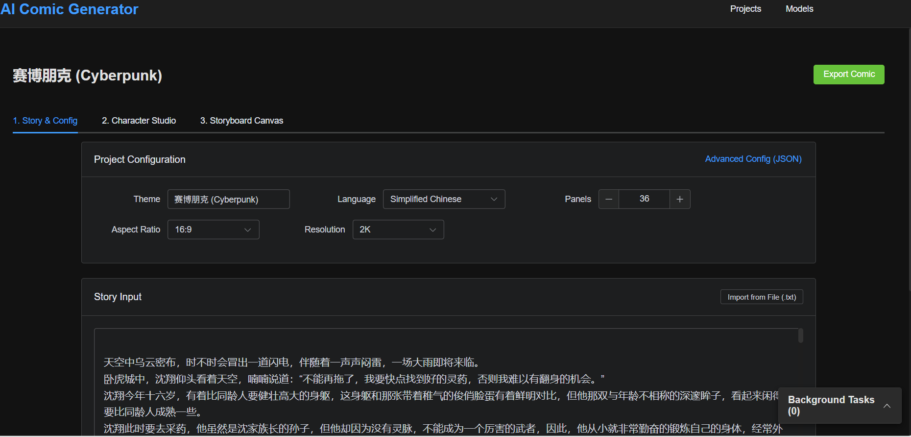
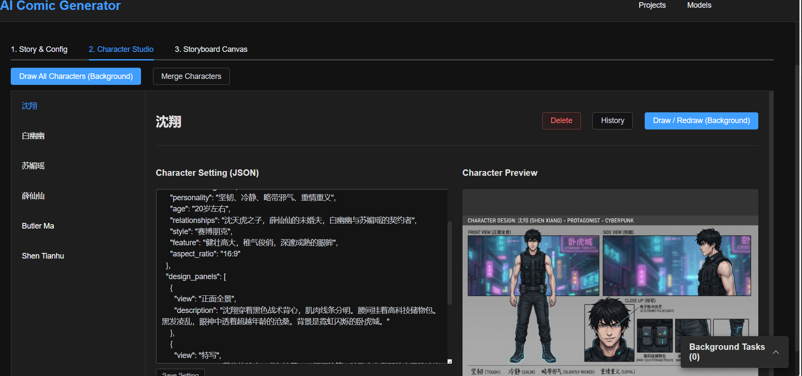
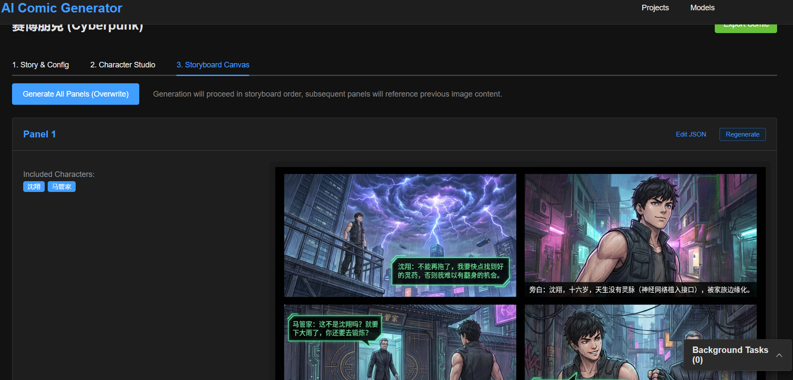
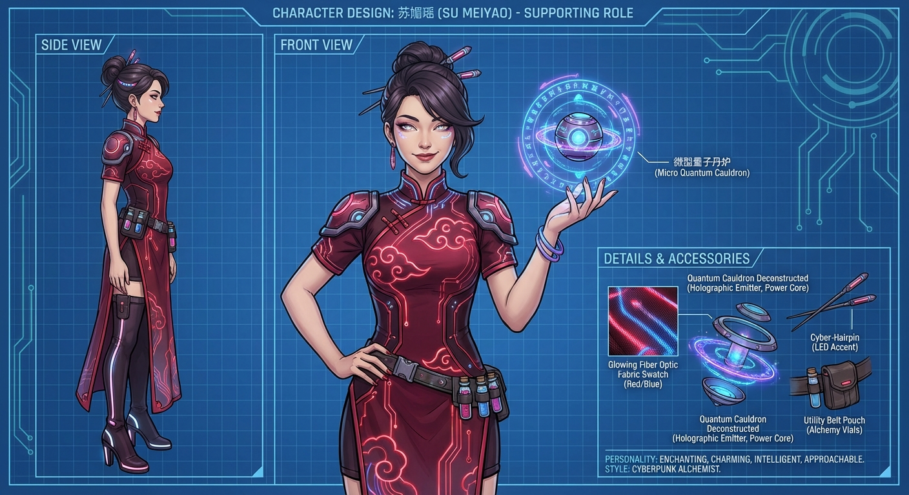
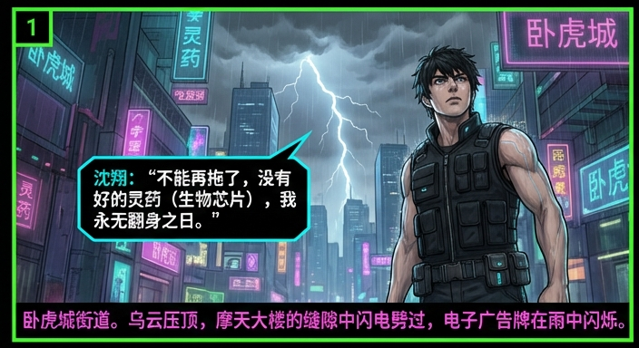
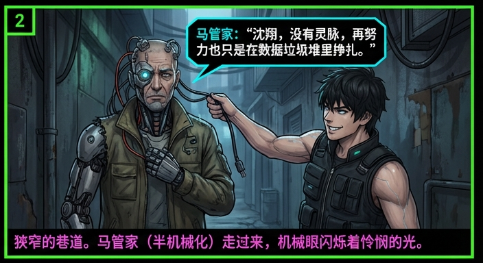
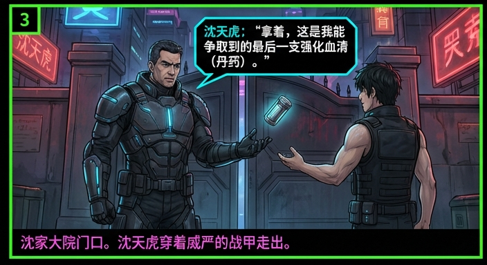
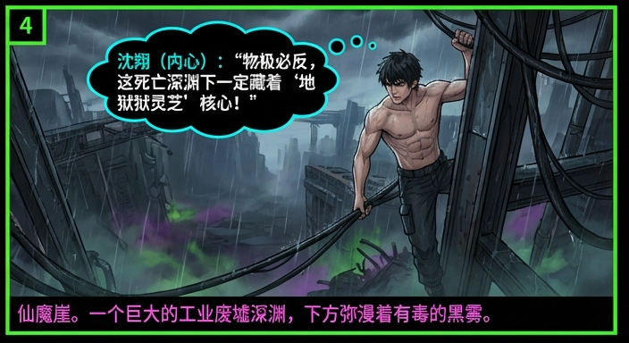

# AI Comic Generator

[English](./README.md) | [中文](./README_CN.md)

An open-source AI-powered manga creation tool that transforms text stories into fully illustrated comics using Google Gemini models. Features include automatic storyboard generation, character consistency checks, and a visual editor.


## ✨ Core Philosophy

*   **JSON-Driven Workflow**: The core of this project is to manage the entire comic creation process through structured JSON data. From story outlines to character settings, and finally to storyboard details, everything is stored and processed as JSON. This ensures data consistency, version control, and easy integration with AI models.
*   **Global Configuration (Global Config JSON)**: A centralized configuration system that controls the artistic direction of the entire project.
    *   **Style Consistency**: Defines the global art style (e.g., "Cyberpunk", "Watercolor"), aspect ratios, and color palettes, ensuring all generated panels adhere to a unified visual language.
    *   **Character & Layout Control**: Manages global character traits and storyboard layout preferences (e.g., panel spacing, border styles).
    *   **Dynamic Synchronization**: Changes to the global config automatically propagate to all storyboard panels, allowing for quick style iterations without manually editing each frame.

## ✨ Core Features

*   **Project Management**: Supports multi-project management, with each project independently saving story, characters, and storyboard data.
*   **Intelligent Scriptwriting**: Input simple story ideas, and AI automatically expands the plot and breaks it down into professional comic storyboard scripts (JSON format).
*   **Character Workshop**:
    *   Automatically extracts characters from the story and generates detailed character settings (three views).
    *   **Character Consistency**: Automatically references character setting images as references (Image-to-Image) when drawing.
    *   **Merge & Deduplication**: Supports manual merging of duplicate generated characters (e.g., "Butler Ma" and "Old Ma").
*   **Storyboard Editor**:
    *   Visually edit prompts, characters, and actions for each panel.
    *   Supports single-panel redrawing and batch generation.
    *   **Context Awareness**: Automatically reads previous storyboard panels and character images when generating storyboards to maintain style and plot continuity.
*   **Style Control**:
    *   Global style configuration (e.g., "Cyberpunk", "Ink Style"), forcing AI to follow settings.
    *   Supports custom dialog box and border styles.
*   **Background Tasks**: Time-consuming batch drawing tasks run in the background, supporting real-time progress viewing.

## 🛠️ Tech Stack

### Backend
*   **Framework**: FastAPI
*   **Database**: SQLite + SQLModel
*   **AI Service**: Google Gemini (Currently only supports Google's latest models)
    *   **Text Model**: `gemini-3-flash-preview`
    *   **Image Model**: `gemini-3-pro-image-preview`
*   **Task Queue**: FastAPI BackgroundTasks

### Frontend
*   **Framework**: Vue 3 + Vite
*   **UI Library**: Element Plus
*   **State Management**: Pinia
*   **HTTP Client**: Axios
*   **Package Manager**: pnpm

## 🚀 Quick Start

### Prerequisites
*   Python 3.9+
*   Node.js 16+
*   pnpm
*   Google Cloud API Key (Requires Gemini API access)

### 1. Backend Configuration

Enter the `backend` directory:

```bash
cd backend
```

Create virtual environment and install dependencies:

```bash
python -m venv .venv
# Windows
.\.venv\Scripts\activate
# Linux/Mac
source .venv/bin/activate

pip install -r requirements.txt
```

Initialize the database using Alembic:

```bash
# Initialize alembic (if not already initialized)
alembic init alembic

# Generate migration script
alembic revision --autogenerate -m "Initial migration"

# Apply migration to database
alembic upgrade head
```

Start backend service:

```bash
# Windows (using provided script)
..\start_backend.bat

# Or run manually
uvicorn app.main:app --reload --host 0.0.0.0 --port 8000
```

### 2. Frontend Configuration

Enter the `frontend` directory:

```bash
cd frontend
```

Install dependencies:

```bash
pnpm install
```

Start frontend service:

```bash
# Windows (using provided script)
..\start_frontend.bat

# Or run manually
pnpm dev
```

Access in browser: `http://localhost:5173`

## 📖 User Guide

1.  **Configure Models**:
    *   Click "Models" in the top navigation bar.
    *   Add a new configuration with your Google API Key.
    *   Ensure the model type is set correctly (Text/Image) and activated.

2.  **Create Project**: Click "New Project" on the homepage and enter the comic title and introduction.
3.  **Story & Configuration**:
    *   Enter your story outline.
    *   Set global styles (e.g., "Japanese Shonen"), aspect ratio, etc.
    *   Click "Generate Storyboard Config", and AI will generate the character list and storyboard script.
    
    

4.  **Character Workshop**:
    *   View AI-generated character settings.
    *   Click "Draw" to generate character portraits.
    *   If there are duplicate characters, use the "Merge Characters" function to clean them up.

    

5.  **Storyboard Editing**:
    *   Check the description of each panel in the storyboard list.
    *   Click "Generate Image" or "Generate All" to start drawing the comic.
    *   Click on an image to view it in large size and support downloading.

    

## 🖼️ Examples

You can find a complete example project in the [example/](./example/) directory, including story scripts, character designs, and generated storyboard panels.

### Character Design

<div align="center">
  
  
  
</div>

### Comic Panels

<div align="center">
  
  
</div>
<div align="center">
  
  
</div>

## 📁 Directory Structure

```
aImanhua/
├── backend/            # FastAPI Backend
│   ├── app/            # Application Code
│   ├── static/         # Generated images and temp files storage
│   └── ...
├── frontend/           # Vue3 Frontend
│   ├── src/            # Pages and Components
│   └── ...
└── ...
```

## 📝 License

MIT License

Copyright (c) 2025 FunASR

Permission is hereby granted, free of charge, to any person obtaining a copy
of this software and associated documentation files (the "Software"), to deal
in the Software without restriction, including without limitation the rights
to use, copy, modify, merge, publish, distribute, sublicense, and/or sell
copies of the Software, and to permit persons to whom the Software is
furnished to do so, subject to the following conditions:

The above copyright notice and this permission notice shall be included in
all copies or substantial portions of the Software.

THE SOFTWARE IS PROVIDED "AS IS", WITHOUT WARRANTY OF ANY KIND, EXPRESS OR
IMPLIED, INCLUDING BUT NOT LIMITED TO THE WARRANTIES OF MERCHANTABILITY,
FITNESS FOR A PARTICULAR PURPOSE AND NONINFRINGEMENT. IN NO EVENT SHALL THE
AUTHORS OR COPYRIGHT HOLDERS BE LIABLE FOR ANY CLAIM, DAMAGES OR OTHER
LIABILITY, WHETHER IN AN ACTION OF CONTRACT, TORT OR OTHERWISE, ARISING FROM,
OUT OF OR IN CONNECTION WITH THE SOFTWARE OR THE USE OR OTHER DEALINGS IN
THE SOFTWARE.
